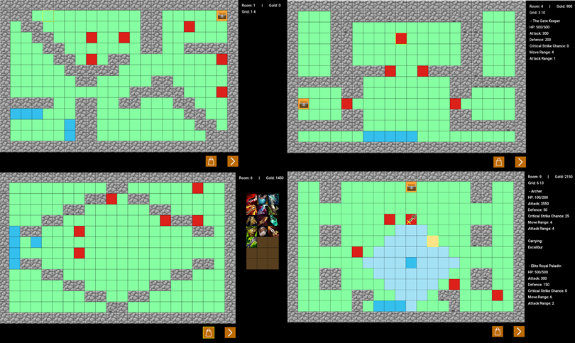

# C++ programming project - Dungeon Crawler

The Dungeon Crawler project is a Rogue-lite, turn-based gameplay. The Rogue-lite element will be implemented with perma-death features, random dungeons, and a currency/upgrade system that carries on after the player’s death, which helps to reduce the difficulty of the game. The turn-based gameplay element takes inspiration from the famous game franchise Fire Emblem, where each room of the dungeon is a tile-based map.

The project was implemented on top of [SFML](https://www.sfml-dev.org/index.php) framework.



### Project Structure

  * `plan/` -- Project plans.

  * `doc/` -- The documentation sources related to your project.

  * `src/` -- Here are the C++ source files.

  * `test/` -- Unit tests implemented with Google unittest framework. 

  * `resource/` -- Resources used in the project (fonts, pictures, ...).

  * `README.md` -- Essential info about this project. 

  * `CMakeLists.txt` -- Makefile of the project. 


### Dependencies
- CMake 3.16.3+
- make
- SFML 2.5.1
- Python 3.6+ (required by Google unit test framework)
- Git

### Running the program
Step 1: Clone the project from repo
```bash
# Do not change the name of project folder!
git clone git@courses-git.comnet.aalto.fi:CPP-F2020/dungeon-2020-4.git 
```
Step 2: Create Makefile and build it
```bash
cd dungeon-2020-4
mkdir build
cd build
cmake .
make dungeon
```
Step 3: Run the program
```bash
./dungeon
```

### Testing
`TextUI` is an Text-based user interface used for debugging purpose. 
To run the program, run the code showing below in the root directory of project. 
 ```bash
cd build
make TEXT_UI
./TEXT_UI
```
There are also some unit tests available. For instance, unit test for `Coord` class 
can be executed by running the following code in the root directory of project
 ```bash
cd build
make coordtest
./coordtest
```

Copyright 2020 © Khoa, Mai, Phi, Taige